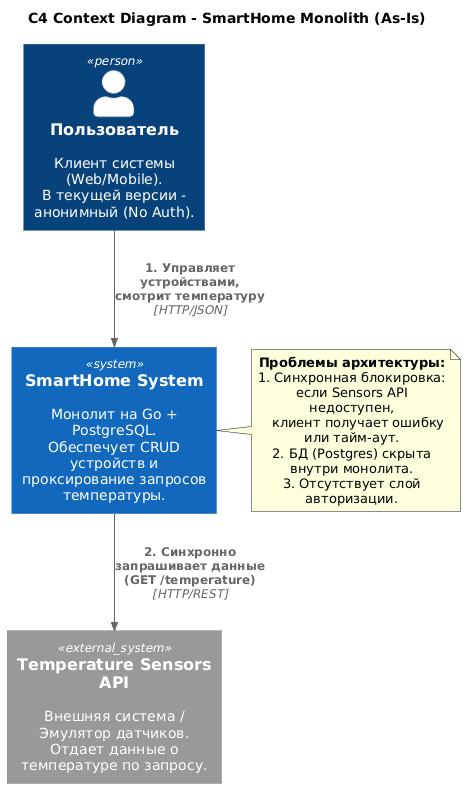
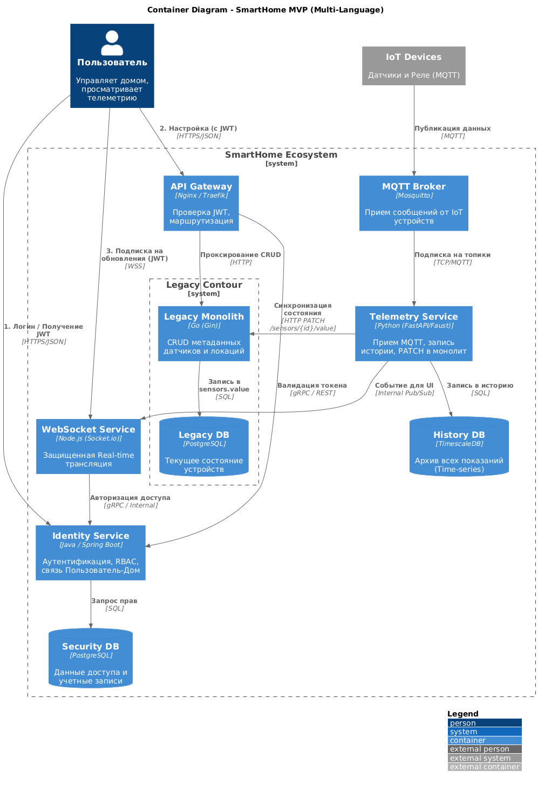
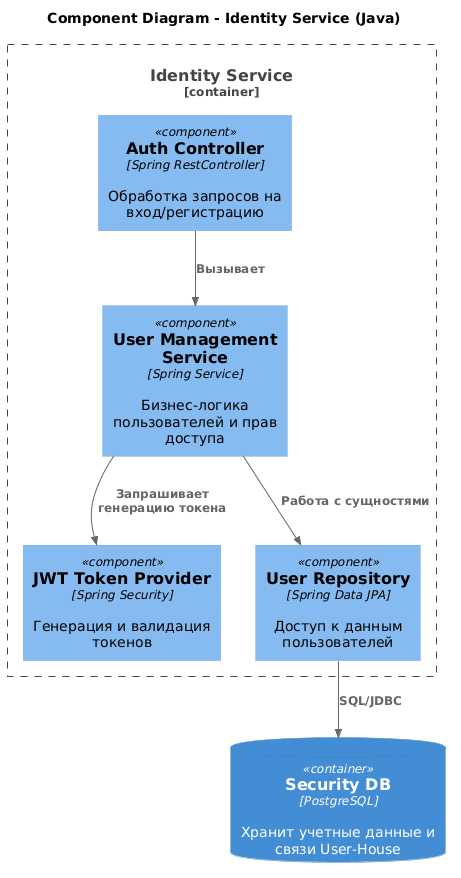
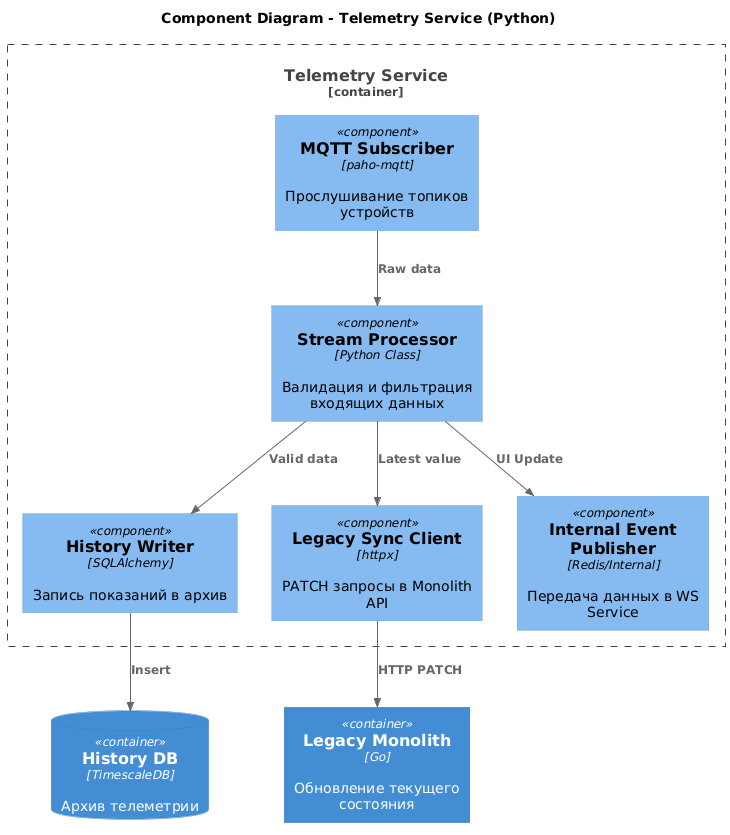
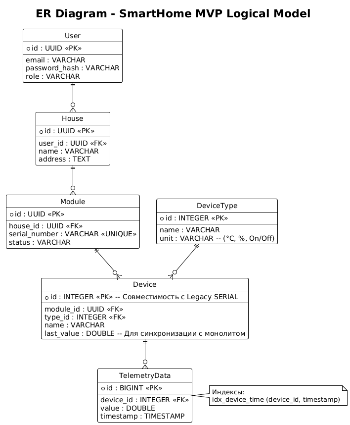
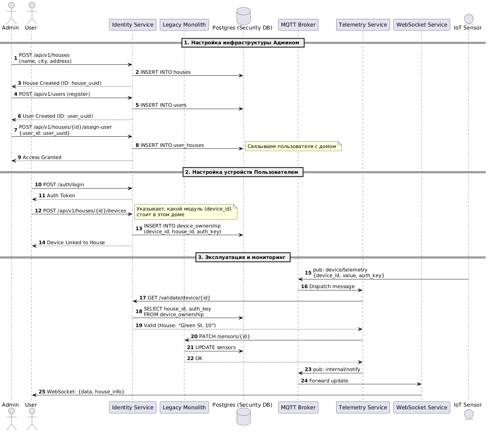

# 🏠 Проект: Гибридная микросервисная архитектура "Умный Дом"

Этот документ содержит описание процесса трансформации монолитного приложения в микросервисную архитектуру в рамках проекта **ya-01**.

---

## Задание 1. Анализ и планирование

### 1. Описание функциональности монолитного приложения
Текущая система (Legacy Monolith) управляет отоплением и мониторингом температуры:
* **Управление отоплением:** Пользователи могут управлять температурным режимом, включать и выключать систему.
* **Мониторинг температуры:** Система считывает данные с датчиков и предоставляет API для просмотра текущих значений.

### 2. Анализ архитектуры монолитного приложения
* **Стек:** Приложение реализовано на языке **Go**.
* **База данных:** PostgreSQL (схема `public`).
* **Взаимодействие:** Все модули (бизнес-логика, API, работа с данными) находятся в рамках одного приложения, что затрудняет масштабирование отдельных функций.

### 3. Определение доменов и границы контекстов
В рамках проектирования выделены следующие логические контексты:
1.  **Identity Context:** Управление пользователями, домами и правами доступа.
2.  **Telemetry Context:** Прием, валидация и маршрутизация данных от IoT-устройств.
3.  **Legacy Context:** Хранение истории температур и базовое управление физическими параметрами.

### 4. Проблемы монолитного решения
* Высокая связанность кода безопасности и бизнес-логики.
* Невозможность масштабировать прием телеметрии независимо от интерфейса пользователя.
* Отсутствие централизованного механизма проверки прав владения датчиками.

### 5. Визуализация контекста (C4)
**Диаграмма контекста (As-Is):**

[Ссылка на исходный код UML](schemas/current/as-is.uml)

---

## Задание 2-3. Проектирование и ER-диаграмма

### Архитектура To-Be
Целевое состояние системы подразумевает разделение на независимые сервисы для повышения безопасности и отказоустойчивости.

**Диаграмма контейнеров:**

[Ссылка на исходный код UML](schemas/to-be/container-diagram.uml)

**Диаграммы компонентов:**
* 
  [Ссылка на исходный код UML](schemas/to-be/components/identity.uml)
* 
  [Ссылка на исходный код UML](schemas/to-be/components/telemetry.uml)

### ER-диаграмма
Отражает новую структуру данных с разделением на схемы для безопасности (Identity) и мониторинга (Legacy).

[Ссылка на исходный код UML](schemas/to-be/ER/FINAL/full.uml)

---

## Задание 4. Создание и документирование API

Для взаимодействия сервисов выбран гибридный подход:
1.  **REST API (Identity Service):** Для синхронных операций управления доступом.
    * [Спецификация OpenAPI](schemas/to-be/API/openapi-identity-service.yaml)
2.  **MQTT + AsyncAPI (Telemetry):** Для асинхронного сбора потоковых данных с датчиков.
    * [Спецификация AsyncAPI](schemas/to-be/API/asyncapi-telemetry.yaml)

---

## Задание 5-6. Разработка и запуск MVP

### Описание решения
В директории `apps/` реализован рабочий прототип (MVP) со следующими компонентами:
* **Identity Service (Java):** Центральный узел авторизации и прав владения.
* **Telemetry Service (Python):** Обработчик сообщений из MQTT.
* **Temperature API (PHP):** Генератор данных для симуляции работы реальных устройств.
* **Legacy Monolith (Go):** Хранилище состояния сенсоров.

**Визуализация процесса (Workflow):**

[Ссылка на исходный код UML](schemas/to-be/workflow.uml)

### 🚀 Инструкция по развертыванию

Все действия выполняются из директории `apps/`:

1.  **Запуск инфраструктуры:**
    ```bash
    cd apps
    init.bat
    ```
    *Скрипт соберет Docker-контейнеры и подготовит базу данных.*

2.  **Проверка бизнес-логики (Автоматический тест):**
    ```bash
    demo_workflow.bat
    ```
    *Сценарий имитирует регистрацию пользователя, привязку дома и успешную передачу данных с датчика.*

### Технологический стек MVP:

Java 17 (Identity)

Python 3.10 (Telemetry)

PHP 8.2 (Temperature API)

Node.js (Websocket Service)

Go (Legacy)

MQTT (Mosquitto)

PostgreSQL 15

Docker

**Статус:** MVP успешно реализован. Все сервисы интегрированы в общую сеть smarthome-network.

---
**Статус проекта:** MVP готов к эксплуатации.